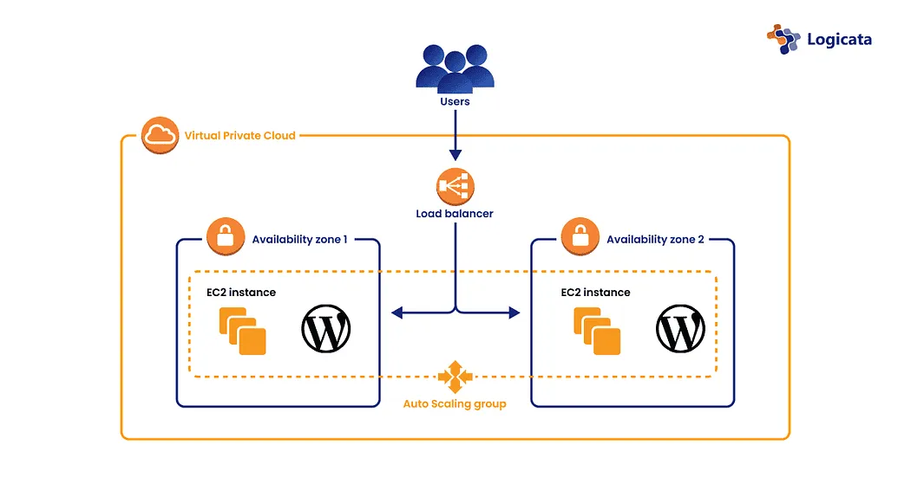

In this guide, we will walk you through the process of setting up a WordPress website on an AWS EC2 instance with an Amazon RDS MySQL database. By following these steps, you will have a fully functional, scalable WordPress site running in the AWS cloud.

1️⃣ Launch an EC2 Instance
To host WordPress, we first need to set up an Amazon EC2 instance, which will act as our web server.

🔹 Steps to Create an EC2 Instance:
Log in to AWS and navigate to the EC2 Dashboard.
Click “Launch Instance” to start the setup.
Select an Amazon Machine Image (AMI):
Choose Amazon Linux 2 (or any compatible Linux distribution).
Choose an Instance Type:
Select t2.micro, which is eligible for the AWS Free Tier.
Configure Instance Settings:
Set up networking, storage, and security groups.
Click “Launch”, select an SSH key pair, and deploy the instance.
Note: Download the key pair (.pem file) and keep it safe, as it is needed to access the server.
2️⃣ Install Apache Web Server on EC2
After launching the instance, we need to install Apache (HTTP Server) to serve our WordPress site.

🔹 Steps to Install Apache on EC2:
Connect to your EC2 instance using SSH:

ssh -i /path/to/your/key.pem ec2-user@your-instance-ip
Switch to the root user:

sudo su
Update the package manager and install Apache:

yum update -y   # For Amazon Linux (use apt for Ubuntu)
yum install httpd -y
Start and enable Apache to run on boot:

service httpd start
chkconfig httpd on
Verify that Apache is running by entering your EC2 public IP in a web browser.
If Apache is installed correctly, you should see the default Apache Test Page.
3️⃣ Download and Configure WordPress
Now that our web server is running, let's download and set up WordPress.

🔹 Steps to Install WordPress:
Move to the Apache web directory:

cd /var/www/html/
Download and extract the latest version of WordPress:

yum install wget -y
wget https://wordpress.org/latest.tar.gz
tar -xzf latest.tar.gz
mv wordpress/* .
rm -rf wordpress latest.tar.gz
Ensure the correct file permissions:

chown -R apache:apache /var/www/html/
chmod -R 755 /var/www/html/
4️⃣ Set Up AWS RDS MySQL Database
WordPress requires a database to store its content. We will create an Amazon RDS MySQL database.

🔹 Steps to Create an RDS MySQL Database:
Go to the AWS RDS Dashboard and click “Create Database”.
Select MySQL as the database engine.
Choose "Free Tier" for the instance type.
Configure database settings:
Set Database Name: wordpress_db
Set Master Username: your_database_username
Set Password: your_database_password
Click “Create Database” and wait for the RDS instance to be ready.
Find the RDS Endpoint:
Once the database is created, navigate to the RDS Dashboard.
Copy the Endpoint (RDS connection string).
5️⃣ Connect WordPress to the RDS Database
Now, we will configure WordPress to use the newly created RDS MySQL database.

🔹 Steps to Configure WordPress with RDS:
Navigate to the WordPress directory on EC2:

cd /var/www/html/
Rename the WordPress configuration file:

mv wp-config-sample.php wp-config.php
Edit the wp-config.php file:

sudo nano wp-config.php
Update the following database configuration lines with your RDS details:

define( 'DB_NAME', 'wordpress_db' );
define( 'DB_USER', 'your_database_username' );
define( 'DB_PASSWORD', 'your_database_password' );
define( 'DB_HOST', 'your_rds_endpoint' ); // Example: mydb-instance.xxxxxx.us-east-1.rds.amazonaws.com
Save and close the file (CTRL + X, then Y, then Enter).
6️⃣ Complete the WordPress Installation
Once everything is configured, it's time to complete the WordPress setup.

🔹 Final Steps:
Open a web browser and enter your EC2 public IP.
You should see the WordPress installation wizard.
Follow the on-screen instructions to:
Set your site title.
Create an admin username and password.
Configure basic settings.
Click "Install WordPress".
Once installed, log in to your WordPress dashboard by visiting:

http://your-ec2-public-ip/wp-admin
🎉 Congratulations! Your WordPress site is live!
You have successfully: ✅ Launched an EC2 instance
✅ Installed Apache Web Server
✅ Downloaded & Configured WordPress
✅ Created an AWS RDS MySQL Database
✅ Connected WordPress to the database
✅ Completed the WordPress installation
